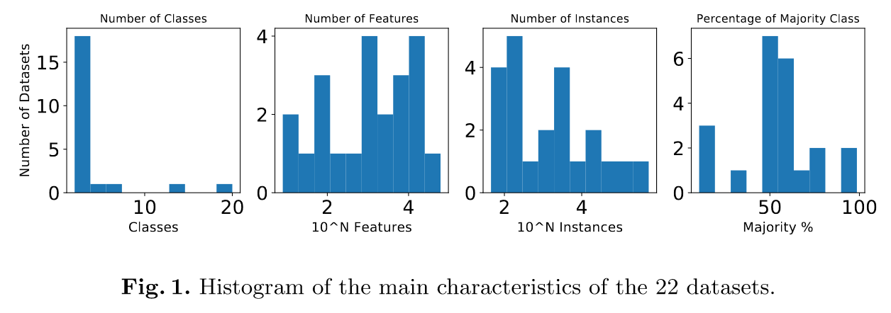
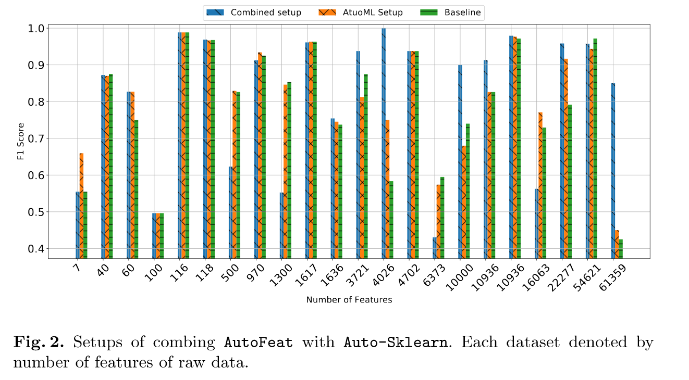
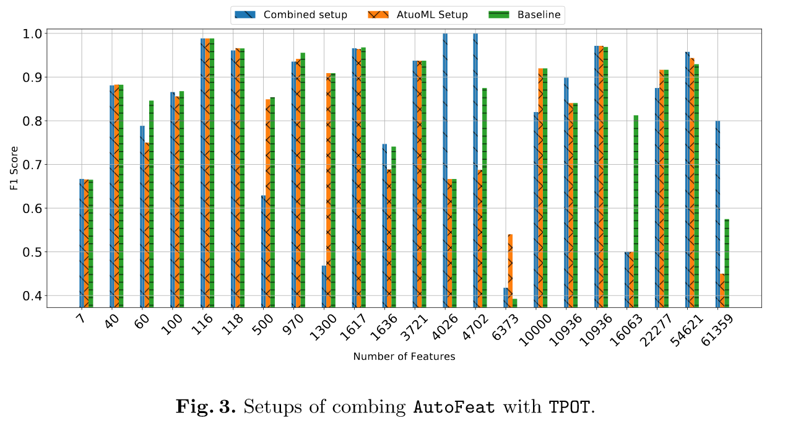
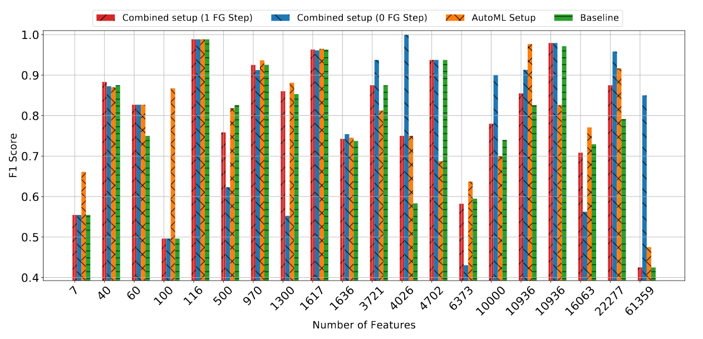
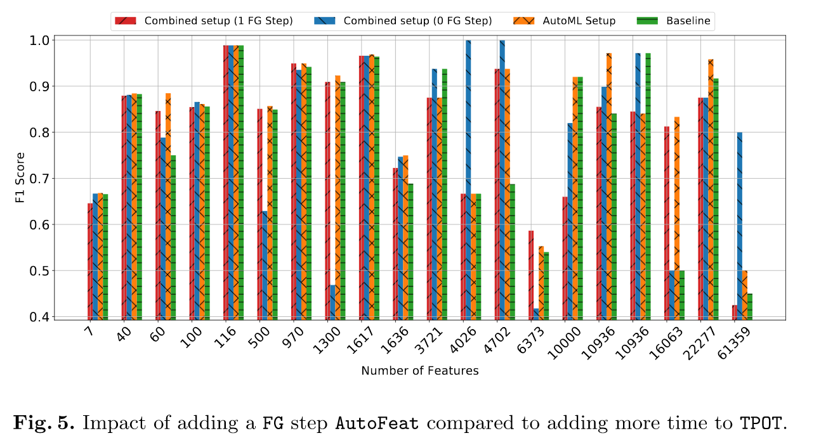

# An Empirical Analysis of Integrating FeatureExtraction to Automated Machine LearningPipeline

Machine learning techniques and algorithms are employed in many application domains such as financial applications, recommendation systems,
medical diagnosis systems, and self-driving cars. They play a crucial role in harnessing the power of Big Data being produced every day in
our digital world. In general, building a well-performing machine learning pipeline is an iterative and complex process that requires 
a solid understanding of various techniques that can be used in each component of the machine learning pipeline. Feature engineering (FE) 
is one of the most time-consuming steps in building machine learning pipelines. It requires a deep understanding of the domain and data exploration 
to discover relevant hand-crafted features from raw data. In this work, we empirically evaluate the impact of 
integrating an automated feature extraction tool AutoFeat into two automated machine learning frameworks, namely, Auto-Sklearn and TPOT, 
on their predictive performance. Besides, we discuss the limitations of AutoFeat that need
to be addressed in order to improve the predictive performance of the automated machine learning frameworks on real-world datasets.
Eventually, We analyze the complexity of AutoFeat and identify its limitations and rooms for improvements.

## Datasets Used

| Dataset      | Dimensions | Classes  | Numeric | Nominal |  Majority %|
| :---        |    :----:   |       :----:   |     :----:   | :----:   |            ---: |
| gina      | (3153, 971)       | 2   |970   | 1   | 50.89   |
| nomao      | (34465, 119)    | 2   |89   | 20|  74.44  |
| Christine      |(5418, 1637)       | 1599   |38   | 20| 50   |
| ailerons      | (13750, 41)       | 2   |40   | 1   | 57.61   |
| GCM      | (190, 16064)       | 14   |16063   | 1   | 15.8  |
| lymphoma_2classes      | (45, 4027)  |2    | 4026   |1  | 48.9   |
| dbworld-bodies-stemmed      | (64, 3722)      | 2   |0   | 3722   | 54.7   |
| dbworld-bodies      | (64, 4703)     | 2   |0   | 4703   | 54.7   |
| AP_Omentum_Ovary      | (275, 10937)     | 2   |10936   | 1   | 72   |
| rsctc2010_3      | (95, 22278)    | 5   |22277   | 1   | 28.42  |
| sonar      |(208, 61)     | 2   |60   | 1   | 53.37   |
| vehicle_sensIT      |(98528, 101)   | 2   |100   | 1   | 50   |
| airlines      |(539383, 8)  | 2   |3  | 5   | 55.5   |
| micro-mass      |(571, 1301) | 10   |1300  | 1   | 10   |

## Results

